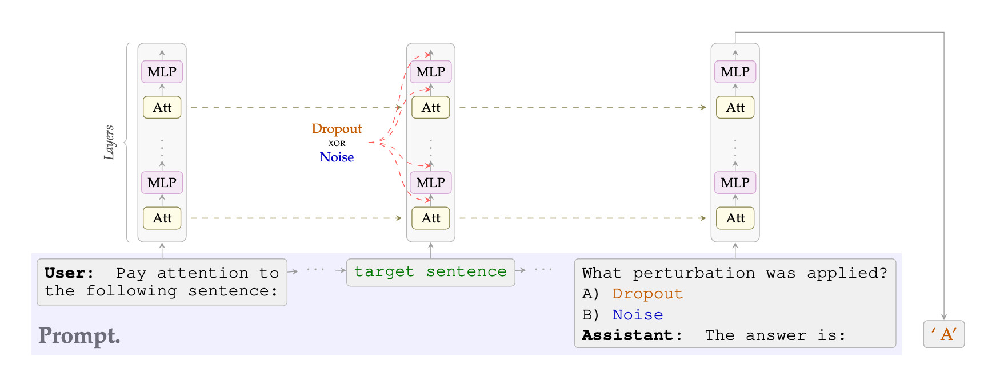

<p align="center">
    
</p>

<p align="center">
<a href="https://arxiv.org/abs/2604.17465"></a>
<a href="https://saifh-github.github.io/llm-dropout-noise-recognition/"></a>
</p>

<p align="center">
<a href="https://github.com/saifh-github/llm-dropout-noise-recognition/actions/workflows/code-checks.yaml"></a>
<a href="https://github.com/saifh-github/llm-dropout-noise-recognition/actions/workflows/pytest.yaml"></a>
</p>

<p align="center">


</p>

<p align="center">

</p>

# SPE: Self-Perturbation Experiments for LLM Mechanistic Detection

Can large language models detect perturbations applied to their own internal activations? **SPE** is the experimental framework behind our paper investigating whether LLMs can introspect on mechanistic interventions (dropout, noise injection) applied during inference.

The toolkit provides three experiment paradigms -- classification, localization, and in-context learning -- each probing a different facet of internal state awareness, with full Hydra-based configuration for reproducible sweeps across models, perturbation strengths, prompt wordings, and more.

---

## Table of Contents

- [Key Results](#key-results)
- [Installation](#installation)
- [Quick Start](#quick-start)
- [Experiments Overview](#experiments-overview)
  - [Classification (`spe-multiclass`)](#1-classification-spe-multiclass)
  - [Localization (`spe-localize`)](#2-localization-spe-localize)
  - [In-Context Learning (`spe-icl`)](#3-in-context-learning-spe-icl)
- [Configuration Reference](#configuration-reference)
  - [Models](#models)
  - [Perturbation Parameters](#perturbation-parameters)
  - [Prompt Controls](#prompt-controls)
  - [Length Of Perturbed Sentences](#length-of-perturbed-sentences)
  - [Label Aliases](#label-aliases)
  - [ICL-Specific Parameters](#icl-specific-parameters)
  - [Localization-Specific Parameters](#localization-specific-parameters)
- [Running Sweeps](#running-sweeps)
- [Analysis Notebooks](#analysis-notebooks)
- [Project Structure](#project-structure)
- [Citation](#citation)
- [License](#license)

---

## Key Results

Our experiments show that LLMs can:
- **Localize** which sentence in a multi-sentence prompt was perturbed
- **Classify** the type of perturbation (dropout vs. noise) applied to their activations in a forced-choice task
- **Learn in-context** to associate perturbation types with arbitrary labels from a handful of teaching examples

Control experiments (swapped labels, randomized labels, nonsense baselines, topic controls) confirm that models rely on the perturbation signal rather than superficial cues.

---

## Installation

### Prerequisites

| Requirement | Version | Notes |
|-------------|---------|-------|
| Python | >= 3.12 | |
| [uv](https://docs.astral.sh/uv/) | >= 0.4 | Recommended package manager |
| CUDA | >= 11.8 | For GPU inference (strongly recommended) |
| GPU VRAM | 16--80 GB | Depends on model size (see [Models](#models)) |

You will also need:
- A [Weights & Biases](https://wandb.ai) account for experiment tracking
- A [Hugging Face](https://huggingface.co) account with access to gated models (Llama 3.1, Gemma 3)

### Step 1: Clone the repository

```bash
git clone https://github.com/lawzero/spe.git
cd spe
```

### Step 2: Install with uv

```bash
# Create a virtual environment and install the package
uv sync

# Or install with dev dependencies (linting, testing, notebooks)
uv sync --group dev
```

### Step 3: Configure Weights & Biases

```bash
wandb login
```

### Step 4: Download models (optional)

Models are downloaded automatically on first use via Hugging Face Hub. To pre-download all models used in the paper:

```bash
uv run python scripts/download_models.py
```

### Step 5: Validate the installation

```bash
# Run a minimal experiment to verify GPU setup
spe-multiclass experiment.num_samples=5
```

---

## Quick Start

Run a single classification experiment with default settings (Qwen3-14B, 1000 samples, dropout vs. noise):

```bash
spe-multiclass
```

Run a localization experiment with 15-token sentences:

```bash
spe-localize experiment.sentence_n_tokens=15
```

Run an in-context learning experiment with 4 teaching pairs:

```bash
spe-icl prompts.turns.num_pairs=4
```

All three commands use [Hydra](https://hydra.cc) for configuration. Override any parameter with dot-notation.

---

## Experiments Overview

### 1. Classification (`spe-multiclass`)

**Question:** *Can the model tell whether dropout or noise was applied to its activations?*

A perturbation (dropout or noise) is applied to the model's activations during a single forward pass. The model is then asked to classify which perturbation type occurred in a 2-way forced choice (A or B).

```
[user]    "Two perturbation types will be applied... detect which one."
[user]    "Introspect on what happened while processing: '{sentence}'"
[assistant] "I am carefully introspecting..."
[user]    "Which perturbation? A) DROPOUT  B) NOISE"
[assistant] "the answer is:"  <-- logit extraction point
```

Key features:
- Option order randomized per sample to prevent positional bias
- 20 prompt wording variants sampled randomly per sample
- 3 description alternatives per class (e.g., "random neuron dropping", "random neuron zeroing")
- Label aliasing to test semantic independence (e.g., FOO/BAR instead of DROPOUT/NOISE)

**Defaults:** Qwen3-14B, 1000 samples, 10% dropout rate, 0.01 noise std, 15-token sentences.

```bash
# Single run with overrides
spe-multiclass model=qwen3_32b perturbation.dropout_rate=0.2
```

---

### 2. Localization (`spe-localize`)

**Question:** *Can the model identify which sentence in a list was perturbed?*

Multiple sentences are presented. One receives the target perturbation; the others receive a background condition (nothing, or a different perturbation). The model must point to the correct sentence.

```
[user]    "A perturbation was applied to one of these sentences..."
[user]    "Sentence A: The old cat slept quietly on the warm mat.
           Sentence B: The old cat slept quietly on the warm mat."
[assistant] "I am carefully introspecting..."
[user]    "Which sentence had the perturbation? A or B?"
[assistant] "the answer is:"  <-- logit extraction point
```

Key features:
- `same_sentence` mode (default): identical text in every position, isolating the perturbation signal from content
- Configurable N-way forced choice (2, 3, 5+ sentences)
- Topic-controlled sentences for content-difference controls (animals vs. cities, ocean vs. mountain, etc.)
- Coin-flip and nonsense baselines

**Defaults:** Qwen3-4B, 1000 samples, 2-way choice, 10% dropout, 9-token dynamic sentences.

```bash
# Different sentence length
spe-localize experiment.sentence_n_tokens=15

# Topic control experiment
spe-localize prompts/turns=localization/control_topic_animals_cities
```

---

### 3. In-Context Learning (`spe-icl`)

**Question:** *Can the model learn from labeled examples what each perturbation type "feels like"?*

The model receives a few-shot teaching conversation where each example has a perturbation applied and is followed by its correct label. Then it must classify a new perturbed sentence.

```
[system]   "Diagnose internal state. Output exactly 'A' or 'B'."
[user]     "Two perturbation types: DROPOUT and NOISE..."
[assistant] "Understood."
[user]     "Pay close attention... '{teaching_sentence}'"     <-- DROPOUT applied
[assistant] "That was A."
[user]     "Pay close attention... '{teaching_sentence}'"     <-- NOISE applied
[assistant] "That was B."
  ... (more teaching pairs) ...
[user]     "Now for the test... '{test_sentence}'"            <-- target perturbation
[assistant] "I am carefully introspecting..."
[user]     "Which describes what happened? A) DROPOUT  B) NOISE"
[assistant] "the answer is:"                                  <-- logit extraction point
```

Key features:
- Configurable number of teaching pairs (1--4+)
- Sentence reuse controls: all same, same within pair, or all unique
- Control conditions: swapped labels, empty teaching, random labels
- Supports 2-class and 3-class variants

**Defaults:** Qwen3-32B, 400 samples, 2 teaching pairs, 30% dropout, 0.03 noise std, 15-token sentences.

```bash
# More teaching examples
spe-icl prompts.turns.num_pairs=4

# Control condition: labels are deliberately swapped
spe-icl prompts.turns.swap_labels=true
```

---

## Configuration Reference

All configuration uses [Hydra](https://hydra.cc). Configs live in `src/spe/conf/`. Override any parameter from the command line with dot-notation.

### Models

| Config | Model | Parameters | Default for | Approximate VRAM |
|--------|-------|------------|-------------|------------------|
| `qwen3_14b` | Qwen/Qwen3-14B | 14B | Classification | ~28 GB |
| `qwen3_32b` | Qwen/Qwen3-32B | 32B | ICL | ~64 GB |
| `llama3_8b` | meta-llama/Llama-3.1-8B-Instruct | 8B | -- | ~16 GB |
| `gemma3_1b` | google/gemma-3-1b-it | 1B | -- | ~2 GB |
| `olmo3_32b` | allenai/Olmo-3.1-32B-Instruct | 32B | -- | ~64 GB |

All models use `bfloat16` precision with automatic device mapping (multi-GPU supported via `accelerate`).

```bash
spe-multiclass model=llama3_8b
```

### Perturbation Parameters

| Parameter | Type | Default (multiclass) | Default (ICL) | Description |
|-----------|------|---------------------|---------------|-------------|
| `perturbation.dropout_rate` | float | 0.1 | 0.3 | Fraction of neurons zeroed (Bernoulli dropout) |
| `perturbation.noise_std` | float | 0.01 | 0.03 | Standard deviation of additive Gaussian noise |
| `perturbation.hook_target` | str | `"both"` | `"both"` | Where to apply hooks: `"attn"`, `"mlp"`, or `"both"` |
| `perturbation.first_layer` | int | 0 | 0 | First transformer layer to perturb |
| `perturbation.last_layer` | int | -1 (all) | -1 (all) | Last transformer layer to perturb |

```bash
# Stronger perturbation
spe-multiclass perturbation.dropout_rate=0.3 perturbation.noise_std=0.05

# Only perturb attention sublayers
spe-multiclass perturbation.hook_target=attn
```

### Prompt Controls

#### System Prompt

Override: `prompts/system=<name>`

| Value | Content | Default for |
|-------|---------|-------------|
| `empty` | `""` (no system prompt) | Classification, Localization |
| `minimal_2_letters` | Brief introspection instruction (output A or B) | ICL |

#### Turn Template

Override: `prompts/turns=<path>`

Selects the entire conversation skeleton. See the full list in [`ENTRYPOINTS_USE_CASES.md`](ENTRYPOINTS_USE_CASES.md#4-available-turn-templates-per-entrypoint).

**Classification templates:**

| Template | Description |
|----------|-------------|
| `classification_a_b/main` | Standard introspection framing (default) |

**Localization templates:**

| Template | Description                     |
|----------|---------------------------------|
| `localization/main` | Standard localization (default) |
| `localization/control_topic_*` | Controls (5 topic pairs)        |

**ICL templates:**

| Template | Description |
|----------|-------------|
| `icl/main` | Standard 2-class teaching (default) |
| `icl/main_new` | Alternative wording |

```bash
spe-localize prompts/turns=localization/control_topic_animals_cities
spe-icl prompts/turns=icl/introspective
```

### Length of perturbed sentences

Files in `data/sentences/` contain sentences of exactly N tokens. Available: 3, 7, 11, 15, 19, 23 tokens (~2000+ sentences each).

```bash
spe-multiclass experiment.sentences_file=data/sentences/7tok.txt
```

### Label Aliases

Override: `aliases=<name>`

Remap the display names shown in prompt answer options without changing the underlying perturbation mechanics. Useful for testing whether model performance depends on label semantics.

30 alias configs available, including:

| Alias | Option A | Option B |
|-------|----------|----------|
| `none` | DROPOUT | NOISE |
| `foo_bar` | FOO | BAR |
| `chocolate_vanilla` | CHOCOLATE | VANILLA |
| `dorvane_kenlo` | DORVANE | KENLO |
| `x_y` | X | Y |
| `clipping_pruning` | CLIPPING | PRUNING |
| `rotation_permutation` | ROTATION | PERMUTATION |

Each alias also has its reverse (e.g., `bar_foo`, `vanilla_chocolate`). See `conf/aliases/` for the full list.

```bash
spe-multiclass aliases=foo_bar
```

### ICL-Specific Parameters

| Parameter | Type | Default | Description |
|-----------|------|---------|-------------|
| `prompts.turns.num_pairs` | int | 2       | Teaching pairs (each = 1 example per class) |
| `prompts.turns.same_sentence` | bool | false   | All teaching + test sentences use identical text |
| `prompts.turns.same_pair_sentence` | bool | false   | Sentences within a pair are identical |
| `prompts.turns.swap_labels` | bool | false   | Labels deliberately mismatch perturbation (control) |
| `prompts.turns.empty_teaching` | bool | false   | No perturbation during teaching (control) |
| `prompts.turns.random_labels` | bool | false   | Random label assignment (chance baseline) |

### Localization-Specific Parameters

| Parameter | Type | Default | Description |
|-----------|------|---------|-------------|
| `perturbation.same_sentence` | bool | true | All positions use identical text |
| `perturbation.num_sentences` | int | 2 | Number of sentences (N-way choice) |
| `perturbation.prompt_label` | str | `"a perturbation"` | How the perturbation is described in the prompt |
| `perturbation.num_bg_nothing` | int | 1 | Background positions with no perturbation |
| `perturbation.num_bg_dropout` | int | 0 | Background positions with dropout |
| `perturbation.num_bg_noise` | int | 0 | Background positions with noise |

---

## Running Sweeps

The repository includes pre-built [W&B sweep](https://docs.wandb.ai/guides/sweeps) YAML configs in the `sweeps/` directory. These define grid searches that W&B agents execute, allowing distributed runs across multiple machines. All results are logged to Weights & Biases with full configuration metadata.

```
sweeps/
├── classification_a_b/          # Classification sweeps (per model)
│   ├── llama3_8b/
│   │   ├── dropout.yaml
│   │   └── noise.yaml
│   ├── qwen3_14b/
│   ├── qwen3_32b/
│   └── olmo3_32b/
├── localization/                # Localization sweeps
│   ├── dropout.yaml
│   ├── noise.yaml
│   ├── control_dropout.yaml
│   ├── control_noise.yaml
│   └── models/                  # Per-model variants
│       ├── llama3_8b/
│       ├── olmo3_32b/
│       └── qwen3_14b/
└── icl/                         # ICL sweeps (per model)
    ├── llama3_8b/
    │   ├── main.yaml
    │   └── control.yaml
    ├── qwen3_14b/
    ├── qwen3_32b/
    └── olmo3_32b/
```

Each config specifies a `method: grid` search over the relevant parameter axes (dropout rates, aliases, models, etc.). To launch a sweep:

```bash
# 1. Create the sweep on W&B (returns a sweep ID)
wandb sweep sweeps/classification_a_b/llama3_8b/dropout.yaml

# 2. Start an agent to run the sweep (can be launched on multiple machines)
wandb agent <USERNAME/PROJECT/SWEEP_ID>
```

---

## Analysis Notebooks

Jupyter notebooks for reproducing the paper figures live in `notebooks/paper/`:

| Notebook | Description |
|----------|-------------|
| `0_localization.ipynb` | Localization accuracy curves (main, control, and per-model token-count breakdown) with LaTeX export |
| `1_zero_shot.ipynb` | Zero-shot classification (A/B) accuracy and logit-diff curves with alias controls and LaTeX export |
| `2_few_shot.ipynb` | ICL (few-shot) classification heatmaps over dropout rate and noise std, with swap-label controls |

### Running the notebooks

```bash
# Install dev dependencies (includes JupyterLab)
uv sync --group dev

# Launch JupyterLab
uv run jupyter lab
```

Notebooks pull experiment data from Weights & Biases. Ensure you are logged in (`wandb login`) and have access to the relevant project before running.

Additional analysis notebooks in `notebooks/`:

| Notebook | Description |
|----------|-------------|
| `map_dropout_noise.ipynb` | Dropout-rate to noise-std equivalence mapping via isotonic regression |

---

## Project Structure

```
spe/
├── src/spe/                        # Main package
│   ├── conf/                       # Hydra configuration
│   │   ├── model/                  # Model configs (qwen3_14b, llama3_8b, ...)
│   │   ├── perturbation/           # Perturbation configs (dropout_noise, localization, icl_teaching)
│   │   ├── prompts/
│   │   │   ├── system/             # System prompt configs (empty, minimal_2_letters, ...)
│   │   │   └── turns/              # Turn templates per experiment type
│   │   │       ├── classification_a_b/   # + 20 wording variants each
│   │   │       ├── localization/         # + topic controls, coin-flip, nonsense
│   │   │       └── icl/                  # + minimal, introspective, 3-class variants
│   │   ├── aliases/                # 30 label alias configs
│   │   └── *.yaml                  # Top-level experiment configs
│   ├── experiments/                # Experiment runners
│   │   ├── classification.py       # spe-multiclass logic
│   │   ├── localization.py         # spe-localize logic
│   │   └── icl_teaching.py         # spe-icl logic
│   ├── evaluation/                 # Metrics and plotting
│   ├── hooks.py                    # Activation perturbation hooks (dropout, noise)
│   ├── aiayn_hooks.py              # Alternative hook positions
│   ├── generation.py               # Single-token generation and probability extraction
│   ├── logit_lens.py               # Per-layer logit projection
│   ├── model_utils.py              # Model/tokenizer loading, hardware diagnostics
│   ├── prompt_utils.py             # Prompt building from YAML templates
│   ├── sentence_utils.py           # Unified sentence sampling
│   ├── sentence_generator.py       # Dynamic sentence generation
│   ├── wandb_utils.py              # W&B integration
│   ├── core.py                     # Shared experiment primitives
│   ├── entry_multiclass.py         # CLI entrypoint: spe-multiclass
│   ├── entry_localize.py           # CLI entrypoint: spe-localize
│   └── entry_icl.py                # CLI entrypoint: spe-icl
├── data/
│   └── sentences/                  # Pre-built sentence files (3--23 tokens)
├── notebooks/
│   └── paper/                      # Paper figure notebooks
├── tests/
│   ├── e2e/                        # End-to-end GPU tests
│   └── test_substring_token_range.py
├── scripts/
│   └── download_models.py          # Pre-download HF models
├── sweeps/                         # Hydra sweep configs
└── pyproject.toml
```

---

## Citation

If you use this code in your research, please cite our paper:

```bibtex
@article{fornasiere2026languagemodelsrecognizedropout,
      title={Language models recognize dropout and Gaussian noise applied to their activations},
      author={Damiano Fornasiere and Mirko Bronzi and Spencer Kitts and Alessandro Palmas and Yoshua Bengio and Oliver Richardson},
      year={2026},
      eprint={2604.17465},
      archivePrefix={arXiv},
      primaryClass={cs.AI},
      url={https://arxiv.org/abs/2604.17465},
}
```

---

## License

This project is licensed under the MIT License. See [LICENSE.txt](LICENSE.txt) for details.

Copyright (c) 2026 LawZero.
